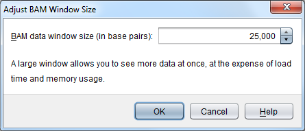

Adjust BAM Window Size
======================

The ``Adjust BAM Window Size`` dialog is used to adjust the total amount of data (known as the BAM window size) that Tablet will load/hold at once when viewing a BAM assembly.

 |TabletBamWindowDialog|

The default size is 25,0000 bases. This means that for any contig viewed, you will only see up to 25,000 bases at once, regardless of the actual size of the contig. See :doc:`bam_data_visualization` for more details.

If you change the size to be either larger or smaller than the current value, then Tablet will reload its view of the selected contig, either growing or shrinking the view to fit. A larger window obviously allows you to see more data at once, but at the expense of the time it takes to load that data from the BAM file, and the additional memory required to hold any reads found.

Ideally, you should set a BAM Window Size that matches what you know about your data. With a low coverage data set, you will be able to set a much larger window size (and maintain fast loading, with low memory usage) than with a deep coverage data set.
