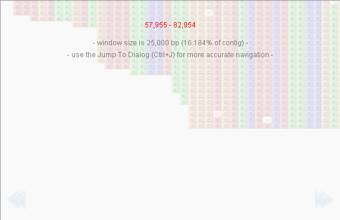

BAM Data Visualization
======================

Tablet displays data on a per-contig basis. Select a contig using the :doc:`the_contigs_browser` to mark it for visualization.

Tablet supports BAM indexed query for visualizing large alignments. Indexed query makes it possible to support visualization of alignments in the hundreds of gigabytes of data on disk. In this view, Tablet displays subsets of the data at a time; while still providing the ability to move easily through - and jump to any point within - the dataset.

The visualization of indexed BAM data is subtly different from the visualization of other assembly formats. While most of the display remains as described in :doc:`data_visualization`, there are a few extra display components to aid the visualization - and navigation - of indexed BAM data.

The BAM bar
-----------

The BAM bar shows the position of the current data window in the overall BAM file. It also displays the size of the current data window relative to the size of the entire data set.

 |TabletBamBar|

The BAM bar always displays the locations of the current (in white) and previous ("ghost") data windows. The white bar (representing the current data window) can be grabbed and moved to select another window of data of that size in the BAM file. Alternatively the BAM bar can be clicked on and white bar will move to this new location. While the white bar is being dragged, the reads canvas displays information to aid selection of a new data window. This includes the starting and ending bases of the new data window, the data window size and the data window size as a percentage of the entire data set.

 |TabletBamReadsCanvas|

The BAM bar also has a right click context menu. This menu contains an option for returning to the previous location in the data set and an option for adjusting the BAM window size using the :doc:`tablet_options` dialog.

Changes to the reads canvas
---------------------------

The reads canvas remains largely unchanged from that described in :doc:`data_visualization`. The main difference is that the area which can be scrolled through is defined by the BAM window size instead of the size of the entire data set. Paging through the data set is also altered. Within a BAM window, paging operates as normal, moving the display forwards or back by the number of bases which fit in the display. At the edge of a BAM window, the paging arrows change behaviour to loading the next BAM window size of data from the BAM file. When a paging arrow is going to do this its colour changes to green.

An addition to the tooltip which appears when the mouse is over to read is the inclusion of CIGAR information for that read. BAM uses an extended CIGAR format to encode information about reads. In BAM the reads are built up from the read sequence and the information in the CIGAR to display the final read.

Overviews
---------

When viewing BAM alignments, data overviews are not of the whole data set as they are when viewing other assembly files. They are overviews of the data in the current BAM data window. Whole data set overviews are not available for BAM alignments. In all other regards the information on overviews in the :doc:`overviews` section relates to BAM data overviews as well.

Contigs panel
-------------

The contigs panel displays the name, length, number of reads, number of features and the percentage mismatch for each contig. When viewing BAM alignments the percentage mismatch cannot be displayed until the data for a contig is loaded, and even then, it will only be the mismatch value for that particular BAM window (which may be smaller than the actual size of the contig).

Coverage printer
----------------

The coverage printer feautre is not currently available while viewing BAM files. The coverage printer prints out the coverage over each reference base. When viewing BAM files the whole data set is not available, as such the coverage printer is disabled when viewing BAM files.
