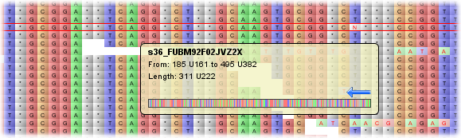
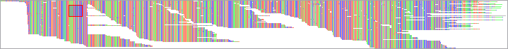
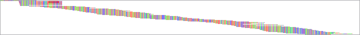
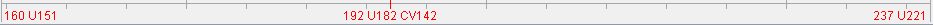
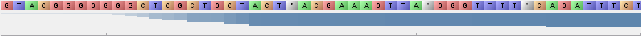

Data Visualization
==================

Tablet displays data on a per-contig basis. Select a contig using the :doc:`the_contigs_browser` to mark it for visualization.

The visualization is broken down into several areas, the most important being the display of read data.

 |TabletReadsVisualization|

Each read is shown aligned against the consensus sequence, with its bases coloured according to the colour scheme selected. In ``Nucleotide`` mode, each DNA base is assigned its own colour. In contrast the ``Classic`` display removes colour information, and acts like more traditional text-based viewers. In ``Direction`` mode, each read is coloured according to whether it was read on the forward or reverse strand. In ``Read Type`` mode single end reads, the first read in a pair and the second read in a pair are each assigned their own colour (orange for single end, green for first in pair, blue for second in pair and red for orphaned reads). In all modes, ``variant bases`` - where the nucleotide in the read differs from the same base in the consensus - are displayed slightly brighter and with red rather than black text. The brightness value can be adjusted using the ``Variants`` slider on the :doc:`ribbon_bar`'s ``Adjust`` tab.

When the mouse is over a read, a tooltip appears which displays information about that read, including its name, padded and unpadded start and end positions and the padded unpadded length of the sequence. Read orientation is displayed via an arrow and a graphic (scaled to fit the width of the tooltip) of all the sequence is also shown. The read currently under the mouse is also highlighted - in red, on the main display and in blue on the Overview (if showing the scaled-to-fit overview).

Right clicking on the display brings up a menu with the options to outline a row or column. To remove highlighting, choose clear all from the menu. There are also options to copy the name of the current read to the clipboard, or copy all of the read's data to the clipboard (its name, length, bases, etc). Finally, there are options which allow you to quickly jump the view to the start or end of a read.

Layout styles
-------------

Tablet can lay out the data in either packed (showing as many reads per line as possible without overlap) or stacked (showing one read per line) formats.

|TabletPacked|

|TabletStacked|

Toggle between the modes using the ``Pack Style`` on the ``Layout Style`` tab on the :doc:`ribbon_bar`.

The scale bar
-------------

As the mouse tracks over the reads, its position is listed on the ``Scale Bar``. This bar provides the column index for the left-most and right-most visible base, along with the value for the base currently under the mouse.

 |TabletScaleBar|

By default, position information is given twice - in padded and unpadded values, for example: 100 U95, meaning padded base 100, but unpadded base 95. The display of unpadded values can be toggled on or off using the ``Hide Unpadded Values`` toggle button located on the ``Options`` tab of the :doc:`ribbon_bar`.

For the base under the mouse, coverage depth is also provided; for example C45, for a coverage value of 45.

Consensus/reference data
--------------

The ``Consensus/Reference Panel`` displays the consensus/reference sequence for the current contig, showing the sequence data for each base, along with a graphical representation of the base's quality information (if available). As with any of the reads, the consensus data can be copied to the clipboard by choosing the appropriate option from the popup menu that appears after right-clicking on it.

Coverage information
--------------------

Per-column coverage information is provided by the ``Coverage Panel``. Coverage is determined by looking for the presence or absence of read data, regardless of what the data is (or whether a read base matches the consensus base for that position). The height of the coverage bar over a particular column represents that column's coverage as a percentage of the maximum coverage for the entire contig.

 |TabletCoverage|

