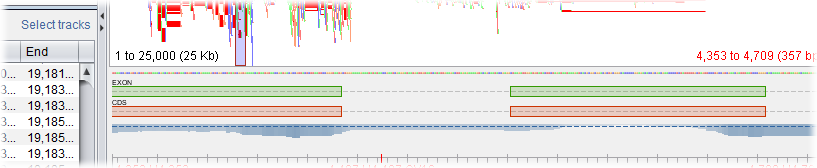

Importing Features
==================

Select ``Import Features`` from the :doc:`ribbon_bar` to import a `GFF3 formatted`_ file containing additional feature information that you want to associated with an assembly.

.. _GFF3 formatted: http://www.sequenceontology.org/gff3.shtml

Once a feature file has been loaded, the ``Features Browser`` tab will become active whenever a contig is selected that contains features.

Clicking on a feature will automatically move the view to the column where the feature starts. It will also be highlighted for a few seconds. (If you wish to outline the column more permanently, right-click it and select ``Outline > Outline Column`` from the popup menu.)

Tablet can treat feature positions as either padded or unpadded depending on whether the ``Feature values are padded`` checkbox is selected or not. This setting determines where in the consensus sequence a feature will start and end, with padded values counting pad (*) characters and unpadded values ignoring them.

Visualizing features
--------------------

Once features have been imported, Tablet will automatically select and display tracks for the first three feature types found.

 |TabletFeaturesTrack|

The active tracks can be enabled, disabled, or reordered using the ``Select Tracks`` option located within the ``Features`` tab.

Each unique type of feature (eg, SNP, INDEL, etc) as defined in the GFF file will be rendered using a distinct colour.

Please note that this functionality is still experimental, and is subject to change. Tablet currently makes no attempt to link features, or to separate features with overlapping positions onto new tracks.
