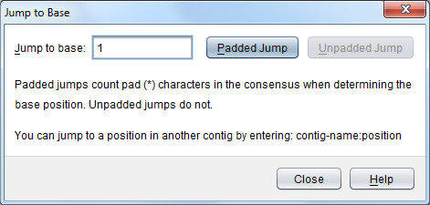

Jump to Base
============

The ``Jump to Base`` dialog is used to quickly jump to a specific base in the assembly.

 |TabletJumpToDialog|

To jump to a base, enter its number, then perform either a padded, or unpadded jump. Padded jumps count pad characters in the consensus sequence, whereas unpadded jumps ignore any padding. Note that sequences displayed in Tablet always count their first base as position "1" (rather than "0").

The following table provides a short example of mapping between padded and unpadded values.

+-----------------+---+---+---+---+---+
|Base             | A | C | \*| G | T |
+=================+===+===+===+===+===+
|Padded position  | 1 | 2 | 3 | 4 | 5 |
+-----------------+---+---+---+---+---+
|Unpadded position| 1 | 2 | \-| 3 | 4 |
+-----------------+---+---+---+---+---+

Jumping to a position in another contig
---------------------------------------

It is also possible to jump to a base position in a contig other than the contig you are currently viewing. To jump to a base in another contig instead of simply entering the base position, enter the contig name and the base position separated by a colon e.g. ``Contig1:200``.
