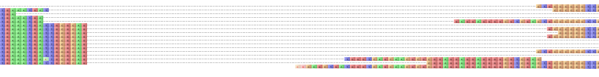
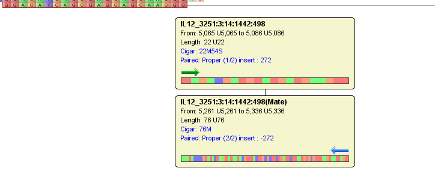
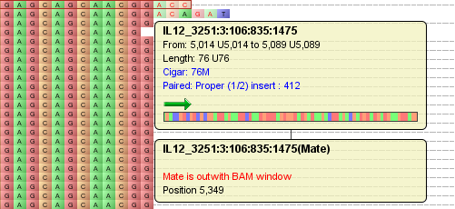
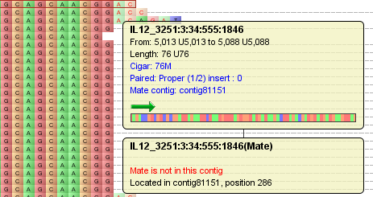

Paired-End Data Visualization
=============================

Tablet displays data on a per-contig basis. Select a contig using the :doc:`the_contigs_browser` to mark it for visualization.

Tablet supports paired-end read data in both the BAM and SAM alignment formats. The visualization of paired-end read data is subtly different from that of single-end read data. While most of the display remains as described in :doc:`data_visualization`, there are a few tweaks to the display components to aid the visualization of paired-end data.

When viewing single end data if the mouse is over a read, that read is highlighted by a red outline. When viewing paired-end data, the read's pair is also highlighted by a red outline. If the reads are on the same line of the display when in either of the paired-end viewing modes a dotted line is drawn between the two reads in the pair. When hovering over a read in the pair - or the line itself - the line becomes a solid black line.

 |TabletMateLines|

As with single-end data, when the mouse is over a read a tooltip appears which displays information about that read. Where this differs from single-end data is the information provided in the tooltip and in additional tooltips which can also be displayed. In addition to displaying a read's name, padded and unpadded start and end positions, the padded unpadded length of the sequence and the CIGAR information for the read. If the read is a paired-end read it will also display pair information including whether or not it is a proper pair, its number in the pair (1/2 or 2/2), and its mate's position. Read orientation is displayed via an arrow and a graphic (scaled to fit the width of the tooltip) of all the sequence is also shown. If the read is a member of a pair, information about its pair is displayed in an additional tooltip.

 |TabletPairedReadsVisualization|

This tooltip displays the pair's equivalent of the original read's data if the pair is in the current BAM window, the following message "Mate is outwith BAM window" when the pair isn't in the current BAM window; plus the position of the pair.

 |TabletPairedEndBamVisualization|

Finally the following message "Mate is not in this contig" when the pair isn't in the contig; plus a message detailing which contig it is in and at which position.

 |TabletPairedReadMateContigVisualization|

Paired-End Pack Styles
----------------------

In addition to the layout styles described in :doc:`data_visualization`, two paired-end specific layout styles are available. These are Packed (Paired-End) and Stacked (Paired-End).

Tablet can lay out the data in either packed (showing as many pairs per line as possible without overlap) or stacked (showing one pair per line) formats.

Toggle between the modes using the ``Pack Style`` drop down menu on the ``Layout Style`` tab on the :doc:`ribbon_bar`.
