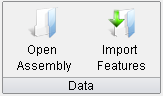
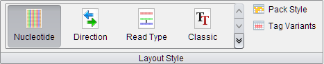
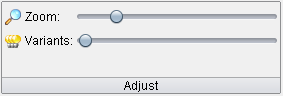
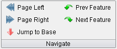
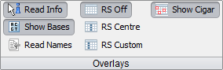
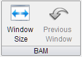
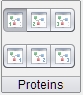
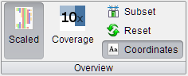
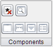

Ribbon Bar
==========

Home: Data
----------

The ``Data Panel`` of the ribbon menu contains controls for importing data into Tablet.

 |TabletRibbonMenuData|

- Open Assembly
	Select this option to display the :doc:`open_assembly` dialog which allows a number of different assembly formats to be opened for viewing in Tablet.

- Import Features 
	Select this option to display the :doc:`importing_features` dialog which allows GFF3 formatted features to be imported into Tablet.

Home: Layout Style
------------------

The ``Layout Style Panel`` contains controls which alter the display of reads within Tablet.

 |TabletRibbonMenuLayoutStyle|

- Nucleotide
	Nucleotide (formerly Enhanced) colouring displays read bases using a nucleotide colouring scheme. Any variants are shown in a lighter colour, with red (rather than black) text.
- Direction
	Direction colouring displays reads using a colour scheme that colours the read according to whether it was read on the forward or reverse strand.
- Read Type
	Read Type colouring displays reads using a colour scheme that colours the read according to whether it is a single end read, the first read in a pair, or the second read in a pair.
- Classic
	Classic colouring provides a simple black on white text scheme, but enhanced slightly to help distinguish reads from the background. Variants are shown in red.
- Pack Style
	Displays a menu with the following options:
  - Packed
		Changes the display so that reads are organised into a ``packed`` layout, where multiple reads are placed on the same row, if there is room to do so.
  - Stacked
  		Changes the display so that reads are organised into a ``stacked`` layout, where every read is positioned on its own row.
  - Packed (Paired End)
  		As the ``packed`` layout but instead of placing multiple reads on the same row, it places multiple pairs on the same row.
  - Stacked (Paired End)
  		As the ``stacked`` layout but instead or placing each read on its own row, it places pairs of reads on their own row.
- Tag Variants
	Changes the display so that bases which do not match the reference base for their base position are coloured in red on the scaled data overview.

Home: Adjust
------------

The ``Adjust Panel`` contains slider controls for adjusting the level of display zoom and the intensity of variant highlighting.

 |TabletRibbonMenuAdjust|

- Zoom
	Adjusts the zoom level of the main display
- Variants
	Controls the intensity of the highlighting of read bases that are different from the consensus at that position (variant bases).

Home: Navigate
--------------

The ``Navigate Panel`` offers controls that aid in navigation.

 |TabletRibbonMenuNavigate|

- Page Left
	Jumps the view one screen's worth to the left.
- Page Right
	Jumps the view one screen's worth to the right.
- Jump to Base
	Opens the :doc:`jump_to_base` dialog, which can be used to jump the view to a specific base (padded or unpadded.
- Prev Feature 
	Moves to and highlights the previous feature in the feature panel's list of features.
- Next Feature
	Moves to and highlights the next feature in the feature panel's list of features.

Home: Overlays
--------------

The ``Overlays Panel`` contains several controls for adjusting which overlays are visible when using Tablet.

 |TableRibbonMenuOverlays|

- Read Info
	Toggles the display of popup information about the read currently under the mouse.
- Show Bases
	Toggles the display of text for bases in the display.
- Read Names
	Overlays the names of reads on the display. This is only available in the stacked view.
- RS Off
	Turns off the read shawowing line and read shadowing. Read shadowing highlights the reads which intersect the read shadowing line.
- RS Centre
	Enables read shadowing, with the line locked to the middle of the display.
- RS Custom
	Enables read shadowing, with the line initially following the mouse. In ``RS Custom`` mode it is also possible to lock the read shadowing line to a base position.
- Show CIGAR
	Overlays CIGAR insertion, deletion, skipping, and clipping events on the reads display. This feature automatically turns itself off when Tablet's zoom level is such that a base takes up less than a pixel on screen.

Advanced: BAM
-------------

The ``BAM Panel`` contains controls for adjusting - and controlling - the display of BAM data.

 |TabletRibbonMenuBam|

- Window Size
	Opens the :doc:`adjust_bam_window_size` dialog, which can be used to alter the number of base positions a BAM window will display.
- Previous Window
	Moves the BAM window back to its previous location - if a previous location exists.

Advanced: Proteins
------------------

The ``Proteins Panel`` contains controls for adjusting the display of protein translations. Each button toggles the display of one of the protein translation tracks. The top three buttons control the forward translations and the bottom three control the reverse translations.

 |TabletRibbonMenuProteins|

Advanced: Overview
------------------

The ``Overview Panel`` contains controls for adjusting the display of the overview. This includes options to alter the type of overview display among others.

 |TabletRibbonMenuOverview|

- Scaled
	Switches the overview display to a scaled data overview mode, which shows a scaled to fit version of the data.
- Coverage
	Switches the overview display to a coverage mode which displays the coverage across the entire dataset.
- Subset
	Opens the :doc:`Subset Overview Dialog <subset_overview>` allowing the alteration of the start and end bases of overview drawing.
- Reset
	Resets the overview, undoing any subsetting which has been applied.
- Coordinates
	Toggle the display of the coordinates overlay. The coordinates overlay displays the start and end points of the current overview, as well as the start and end points of the current data window.

Advanced: Components
--------------------

The ``Components Panel`` contains several controls for adjusting various miscellaneous options.

 |TabletRibbonMenuComponents|

- Hide Unpadded Values
	Toggles whether or not unpadded values are shown alongside their padded counterparts in the various display components.
- Show/Hide Overview
	Opens a menu allowing you to toggle the Overview on or off, or to select which overview visualization to display.
- Hide Consensus
	Toggles on or off the Consensus display panel.
- Hide Scale Bar
	Toggles on or off the Scale Bar display panel.
- Hide Coverage
	Toggles on or off the Coverage display panel.
- Hide Control Panel
	Toggles on or off the Contigs/Features/Search Control panel.
