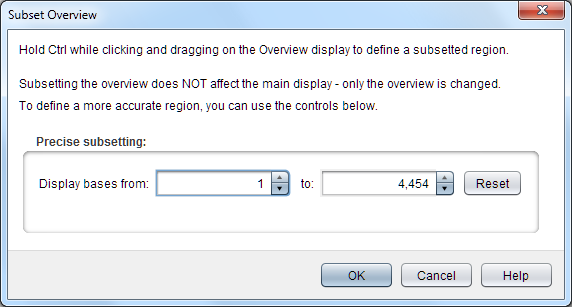
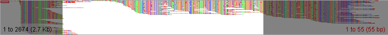

Subset Overview
===============

The ``Subset Overview`` dialog is used to adjust the start and end points of the overviews that Tablet displays. This allows you to specify a subset of the data set which you would like to see represented in the overview.

 |TabletSubsetOverviewDialog|

The default values for the *display bases from* and *to* are the start and end points of the currently displayed contig. If you alter the subset values, you should ensure that the from value should always be lower than the to value. If it is not, the overview will be reset to its original state.

The ``Subset Overview`` dialog allows for very precise subsetting of the overview, however it is also possible to quickly subset the overview from within the main tablet window. To do this you click and drag on the overview canvas with the correct keyboard modifier for your platform (CTRL for Windows/Linux, CMD for OSX). The point of the first click is the start point for the new subset and the point of release of the mouse is the end point.

 |TabletDragSubset|

When subsetting the overview in this manner the area that will be visible in the new overview remains the same colour, whereas areas which won't be visible in the new overview are greyed out.
