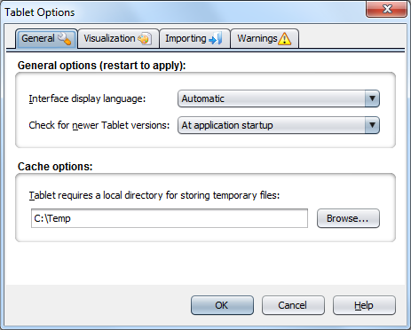
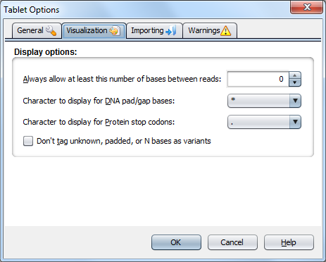
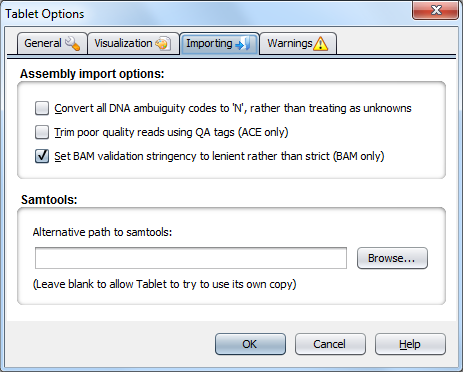
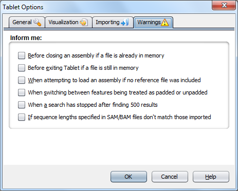

Tablet Options
==============

The Preferences dialog can be used to modify various settings that affect the way Tablet is used and is displayed.

General
-------

The ``General`` tab includes options which are specific to Tablet's general operation.

 |TabletNBGeneralPanel|

General options (restart to apply):

- Interface Display Language
	This setting determines what language Tablet will display its user interface in.
- Check for newer versions of Tablet
	This setting determines how often Tablet will attempt to connect back to its download server to see if a newer version is available. The options available are Never, At application startup, Once a day, Once a week, and Once a month.

Cache options:

- Tablet requires a local directory for storing temporary files
	Specifies the directory where Tablet will keep its disk cache (of the assembly data). The size of the cache depends on the size of the assembly, so it is advisable to pick a location with plenty of free space.

Visualization
-------------

The ``Visualization`` tab allows you to customise elements of Tablet's visual display.

 |TabletNBVisualizationPanel|

Display options:

- Always allow at least this number of bases between reads
	Forces Tablet to ensure that adjoining reads are always separated by at least the number of bases specified. As this affects how the data are packed, reopen the current contig to see any changes.
- Character to display for DNA pad/gap bases
	Determines what character will be shown whenever a padded base is displayed.
- Character to display for Protein stop codons
	Determines what character will be shown whenever DNA translates to a stop codon.
- Don't tag unknown, padded, or N bases as variants
	If selected, Tablet will no longer render these bases as variants, meaning they will not stand out from the rest of the data (or be highlighted in red).

Importing
---------

The ``Importing`` tab allows you to modify how Tablet reads from data files.

 |TabletNBFormatsPanel|

Assembly import options:

- Convert all DNA ambuiguity codes to 'N', rather than treating as unknowns
	If selected, any nucleotides encoded using ambuiguity codes will be read as N rather than being treated as unknown (Tablet has no support for ambuiguity codes). This will affect how the protein translations are displayed.
- Trim poor quality tags using QA tags (ACE only)
	Affecting the import of ACE files only, if selected, this option will cause Tablet to parse the QA tags found within ACE files. These tags cause reads to be trimmed for quality. The resultant read once loaded into Tablet may be shorter than if the option is left unselected and regions of low quality will no longer be displayed.
- Set BAM validation stringency to lenient rather than strict (BAM only)
	Affecting the import of BAM files only, if selected, Tablet will ignore any errors often associated with malformed BAM assemblies and will attempt to display the file as if it was OK. Any errors that are found will be written to the output.log file in Tablet's install directory. See samtools/picard documentation for more details on strict/lenient parsing options.
- Always cache read data to disk while importing
	Selecting this option will ensure Tablet keeps the majority of read data for an assembly in a disk-based cache, rather than in memory. This marginally reduces performance, but has a significant saving on memory.
- Bypass read disk caching for BAM files
	Because BAM files are already indexed and allow for quick access, there is no need for Tablet to (re)cache them for its own use. The only time you may wish to disable this option is if you are running Tablet with a very large BAM window size and wish to further reduce memory usage.

Samtools:

- Alternative path to samtools
	When opening BAM files, Tablet attempts to use its own bundled copy of samtools to gather read count statistics from the index file (using the "samtools idxstats" command). Tablet's distributable versions may not work on every operating system, so you can use this option to provide the path to a known working version of samtools (0.1.8 or higher).

Warnings
--------

The ``Warnings`` tab allows you to switch on or off the various warnings that Tablet can pop up from time to time. If an item is checked, Tablet will display a relevant warning to you whenever its associated action occurs. Unchecking an item means that Tablet will proceed with the action without warning you.

 |TabletNBWarningPanel|

- Before closing an assembly if a file is already in memory
	This warning occurs if you attempt to close an open assembly file. Some files can be large, and take time to load, so Tablet will check that you really '''do''' want to close the file before doing so.
- Before exiting Tablet if a file is still in memory
	Similar to the above warning; this time the warning happens if you attempt to close Tablet while a file is still loaded.
- When attempting to load an assembly if no reference file was included
	Not all assembly file formats include reference/consensus information in the primary file and it must be provided in a separate file. Tablet does not need this information, but can warn you if it is not included.
- When switching between features being treated as padded or unpadded
	GFF3 feature files include position information that Tablet can treat as either a padded or unpadded position. Depending on the data, the difference between a padded or unpadded position can be significant, and you may wish Tablet to remind you of this.
- When a search has stopped after finding 500 results
	Continuing to search after 500 matching hits have been found has a negative impact on memory consumption. Disable this option to stop Tablet from reminding you of this fact each time it searches.
- If sequence lengths specified in SAM/BAM files don't match those imported
	Assemblies in SAM or BAM formats - although they do not store reference data - do store the name and length of the each reference sequence. Check this option to have Tablet warn whenever these specified lengths do not match the actual lengths of any reference sequences that you import.
