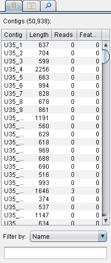

The Contigs Browser
===================

The ``Contigs Browser`` panel displays a list of all the contigs in the current assembly. It lists each contig's name, length (of the consensus sequence), the number of reads within it, and the number of features associated with it (if any). Select any contig to visualize its data.

The browser also features a filtering mechanism, which allows the number of contigs shown in the list to be reduced. Filtering is possibly by name, minimum/maximum contig length, minimum/maximum number of reads, or minimum/maximum number of features.

 |TabletContigsBrowser|

